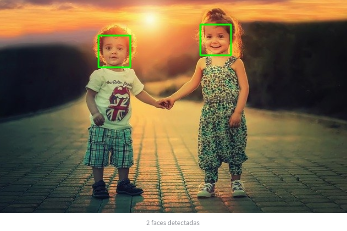
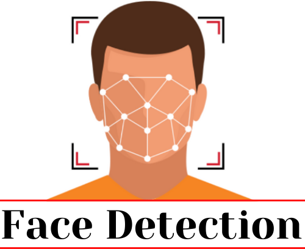
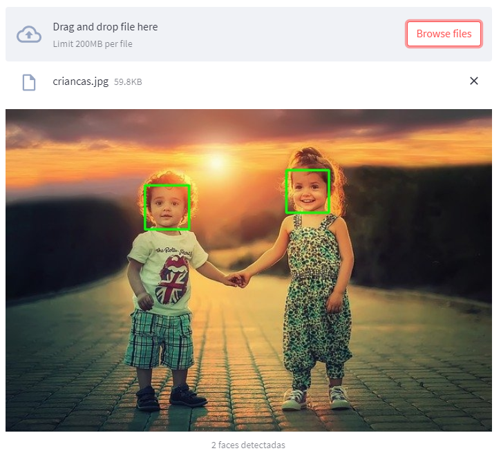

# FaceDetection

FaceDetection é um aplicativo na nuvem utilizando a biblioteca [Streamlit](https://streamlit.io/) (Python) para rodar um modelo de classificação de rostos utilizando o [OpenCV](https://opencv.org/). Para acessá-lo [Clique aqui](https://share.streamlit.io/guihungaro/facedetection/main). 

----

Para fazer o reconhecimento facial irei utilizar um algoritmo chamado Haar Cascade, os seus modelos podem ser encontrados no [repositório do GitHub](https://github.com/opencv/opencv/tree/master/data/haarcascades).

Neste projeto teremos este modelo de reconhecimento:

  - 01.[Reconhecimento facial](https://github.com/opencv/opencv/blob/master/data/haarcascades/haarcascade_frontalface_default.xml)

A ideia é que o usuário possa fazer o upload da foto que deseja detectar o número de faces.

Depois que o upload seja feito, a foto é convertida para a biblioteca *OpenCV*, transformada em escalas de cinza e depois o aplicativo roda o modelo do *Haar Cascade* para reconhecimento facial.

No final são desenhados retângulos onde as faces foram reconhecidas na imagem original e a imagem é exibida.

----

# ATENÇÃO:

* Este projeto é apenas uma brincadeira para integrar a biblioteca OpenCV com o Streamlit e rodar um aplicativo de reconhecimento facial. O aplicativo em si não possuí nenhuma aplicação comercial na forma como esta. 

* Detecção de objetos em uma imagem pode ser muito utilizado em diversas aplicações do mundo real, como contar clientes em uma loja, contar carros que passam em uma rua, detectar ameaças (assaltos, sequestros, etc).

* Este projeto demorou 2h40 para ser feito.
